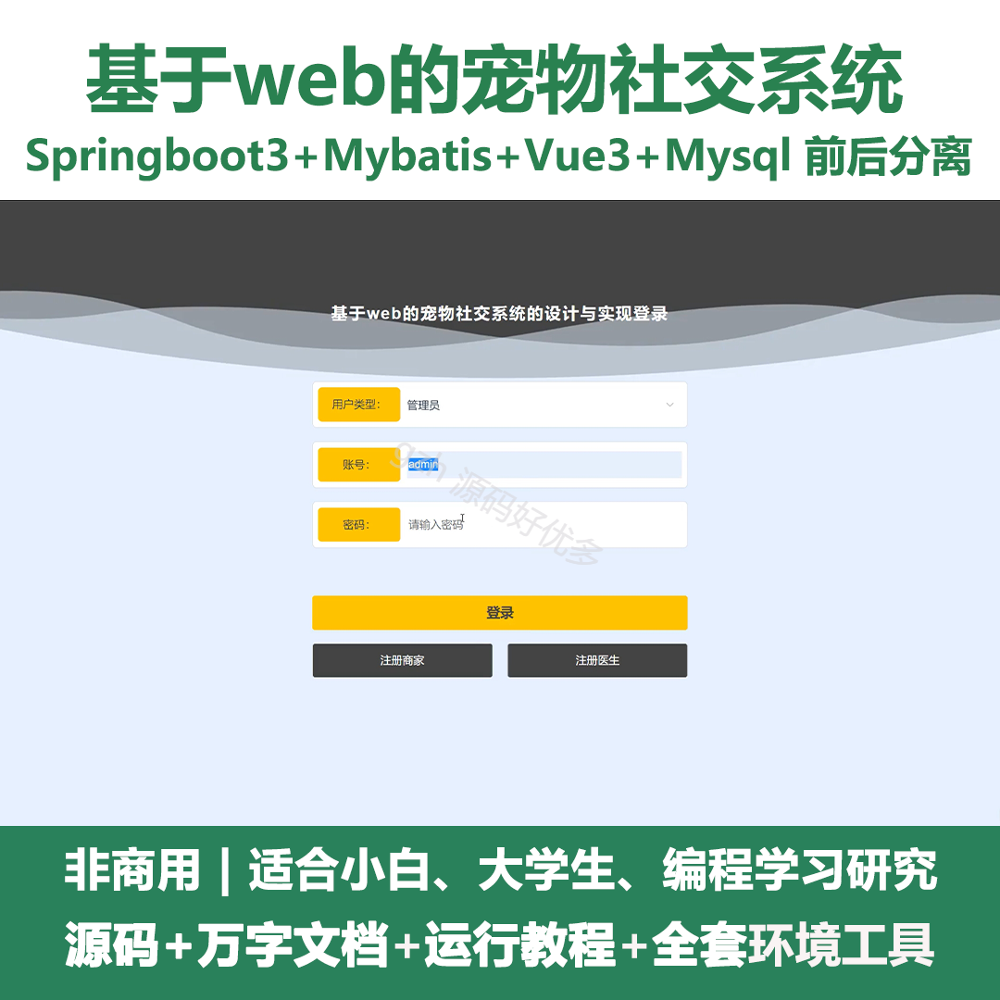
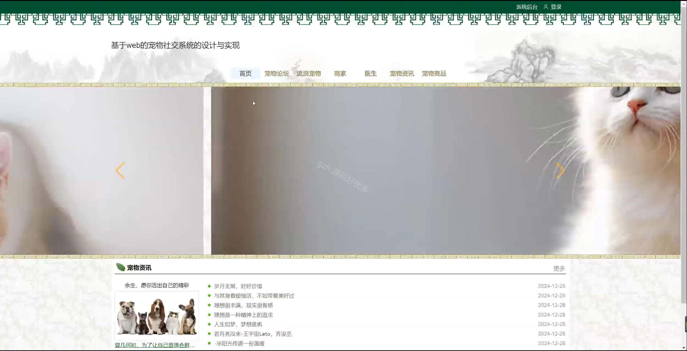
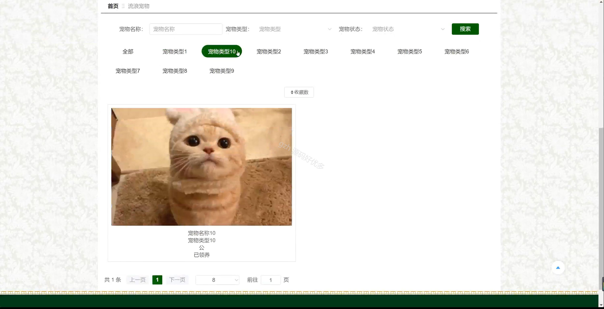
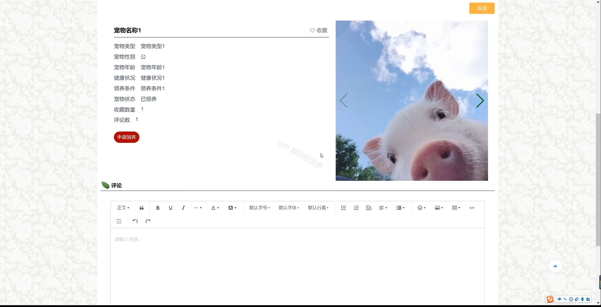
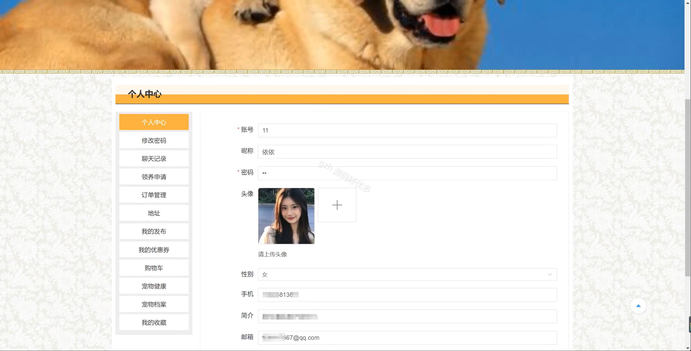
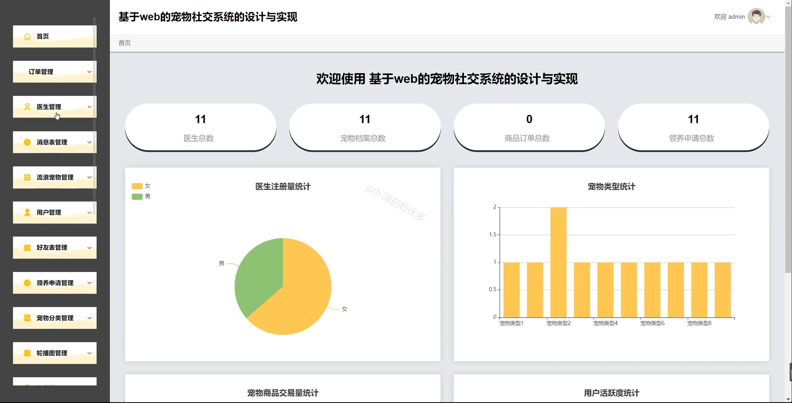
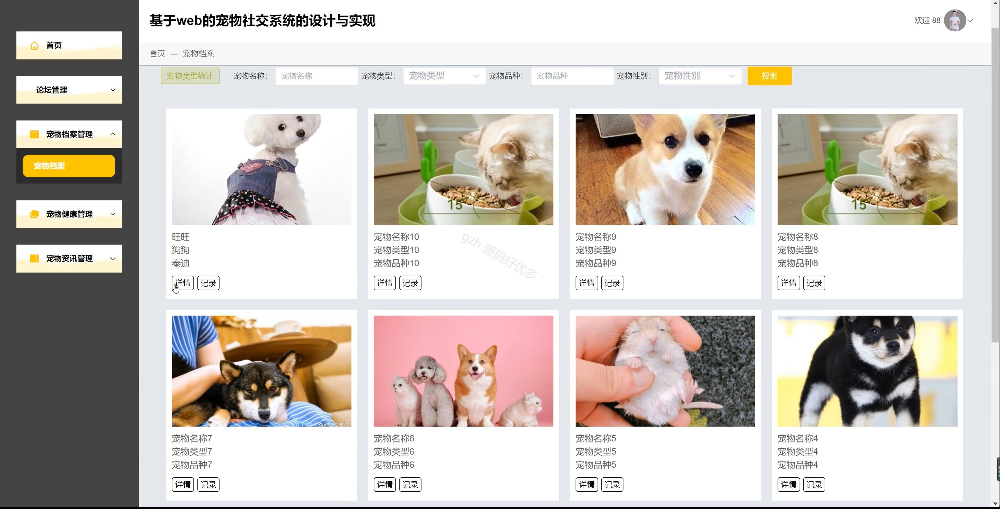
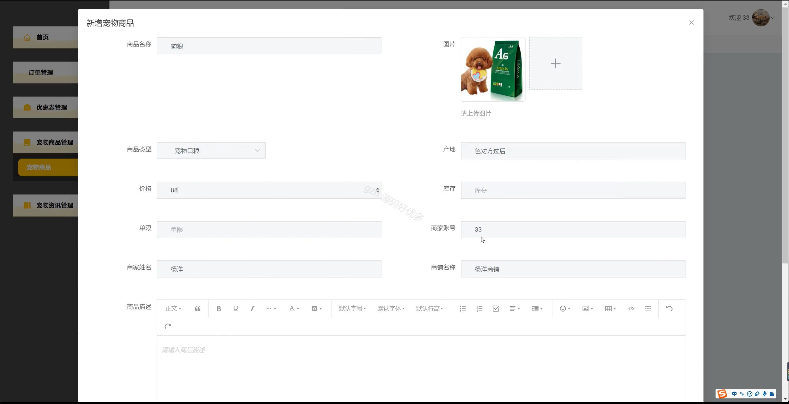
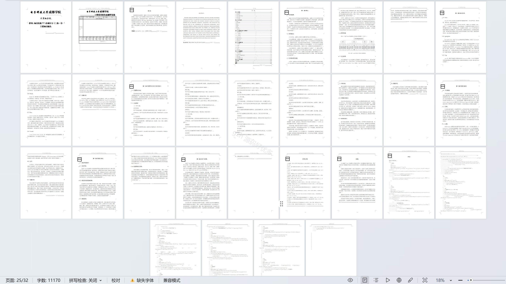

# springbootA230D
springbootA230D基于web的宠物社交系统+LW
 
## 查看主页获取源码

### 一、关键词
领养申请管理、宠物商品管理、流浪宠物管理

### 二、作品包含
源码+数据库+设计文档万字+全套环境和工具资源+本地部署教程

### 三、项目技术
前端技术：Html、Css、Js、Vue3.0、Element-plus
后端技术：Java、SpringBoot3.0、MyBatis

### 四、运行环境（以下版本亲测，其他版本未知，请自测）
开发工具：IDEA/eclipse  + VSCODE

数据库：MySQL5.7（最低要5.7版本）

数据库管理工具：Navicat10以上版本

环境配置软件： JDK17 + Maven3.6.3

前端Nodejs：20

浏览器：谷歌浏览器

### 五、项目介绍
项目编号：springbootA230D

基于 web 的宠物社交系统可用于实现宠物爱好者间的社交互动、宠物信息管理等功能。

角色：管理员、用户、商家、医生

管理员：首页、订单管理、医生管理、消息表管理、流浪宠物管理、用户管理、好友表管理、领养申请管理、宠物分类管理、轮播图管理、商家管理、论坛管理、优惠券管理、宠物资讯管理、宠物健康管理、商品类型管理、宠物商品管理、宠物档案管理。

用户：首页、宠物论坛、流浪宠物、商家、医生、宠物资讯、宠物商品、个人中心、修改密码、聊天记录、领养申请、订单管理、地址、我的发布、我的优惠券、购物车、宠物健康、宠物档案、我的收藏。

商家：首页、订单管理、优惠券管理、宠物商品管理、宠物资讯管理。

医生：首页、论坛管理、宠物档案管理、宠物健康管理、宠物资讯管理。

### 六、运行截图

